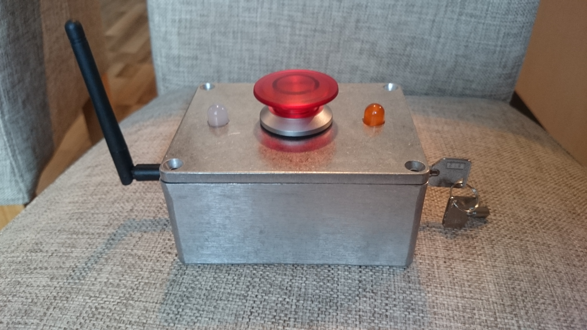
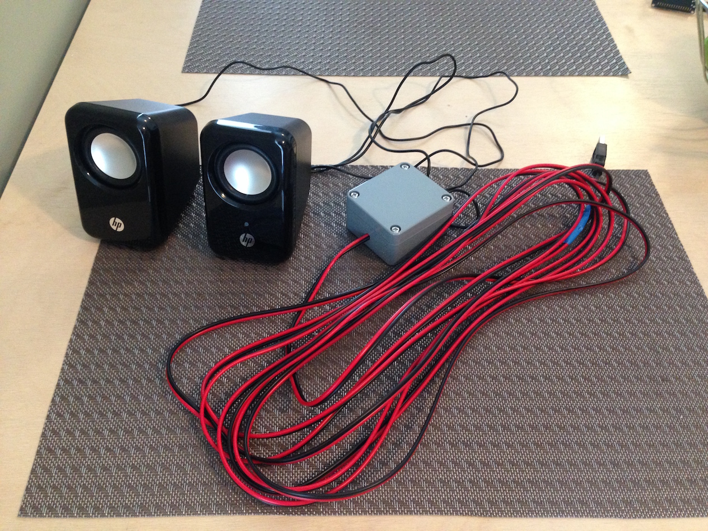
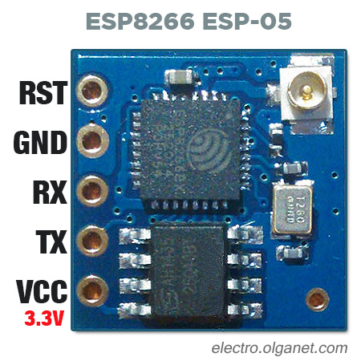

# Big Red Button (codename Crying Eagle)

Push the button and The Star-Spangled Banner plays!

## Button

### Components

- [Big Red Button - 10€](http://www.oomipood.ee/product/lxe30_1_o_c_r_automaatika_seen_luliti_punane_30mm_0_1_indik_no_nc_6a)
- [Aluminum Box - 16€](http://www.oomipood.ee/product/box_g113_alumiiniumkarp_veekindel_55_90_115mm)
- [Lock Switch - 5.50€](http://www.oomipood.ee/product/ks4_lukkluliti_on_on_250v_0_5a_12mm)
- [Orange LED - 0.25€](http://www.oomipood.ee/product/l_813ed_led10_orange_100mcd_50deg)
- [Green LED - 0.40€](http://www.oomipood.ee/product/ospg0262a_mn_led_10mm_roheline_2400mcd_60deg_matt)
- [ESP8266-05 with antenna - 2.70€](http://www.aliexpress.com/item/ESP8266-Esp-05-Remote-Serial-Port-WIFI-Transceiver-Wireless-Control-Module/32279248425.html?ws_ab_test=searchweb201556_8,searchweb201602_3_10037_10017_405_404_407_406_10032_10040,searchweb201603_4&btsid=683f16d2-d03c-4585-915f-38a4009c7b44)
- [Two resistors ~56ohm - 0.01€](http://www.aliexpress.com/item/Hot-New-Arrival-High-Quality-Hot-Sale-Lowest-Price-1460-pcs-Metal-Film-Resistor-Kit-Pack/32638518266.html?ws_ab_test=searchweb201556_7,searchweb201602_1_10037_10017_405_404_407_406_10032_10040,searchweb201603_7&btsid=2e631a1e-a961-4a65-87ff-91ad367d795d)
- [Battery pack - 1.50€](http://www.oomipood.ee/product/12445_gby_patareipesa_3_aa_korvuti_kinnine_karp_juhtmetega)
- [Voltage regulator - 1.60€](http://www.oomipood.ee/product/ld1117v33_dg_ld1117v33_dg?q=LD1117V33)

**Total: 37.96€**

[Code](src/button)

## Player

### Components

- [Speakers - 21€](https://www.klick.ee/hp-multimedia-2-0)
- [Wire (6m) - 1.5€](http://www.oomipood.ee/product/lsp_cca_0_50br_kolarikaabel_2_0_5mm_punane_must_cca)
- [Plastic Box - 4€](http://www.oomipood.ee/product/box_g302_plastikkarp_veekindel_35_58_64mm)
- [ESP8266-01 - 1.57€](http://www.aliexpress.com/item/Free-shipping-10PCS-ESP8266-serial-WIFI-wireless-module-wireless-transceiver-100-new/32258674935.html?ws_ab_test=searchweb201556_8,searchweb201602_3_10037_10017_405_404_407_406_10032_10040,searchweb201603_4&btsid=5c66499e-4467-4918-bfd8-4421abd294b4)
- [Voltage regulator - 1.60€](http://www.oomipood.ee/product/ld1117v33_dg_ld1117v33_dg?q=LD1117V33)
- [Player - 3.60€](http://www.electrodragon.com/product/wtv020-sd-musicvoice-play-module-sd-card-based/)
- 1GB SD card (not manufactured anymore)

**Total: 33.27€**

[Code](src/player)

## Other stuff

- [Universal PCB](http://www.oomipood.ee/product/h25ps160_makettplaat_100_160mm_3_sed_saared)
- [Wires](http://www.electrodragon.com/product/24awg-common-used-wires-kit-5810cm/)
- [NodeMCU Development Board](http://www.aliexpress.com/item/New-Wireless-module-CH340-NodeMcu-V3-Lua-WIFI-Internet-of-Things-development-board-based-ESP8266/32509020044.html?ws_ab_test=searchweb201556_8,searchweb201602_3_10037_10017_405_404_407_406_10032_10040,searchweb201603_4&btsid=17c684bb-aa4a-4706-aacf-0ccfa252d694)

## Useful information

### Links

- [NodeMCU firmware for ESP8266](http://nodemcu-build.com/)
- [Different ESP8266 modules](http://www.esp8266.com/wiki/doku.php?id=esp8266-module-family)
- [New firmware on ESP8266-05](http://hacke.re/projects/flashing-new-firmware-to-the-esp8266-esp-05/)

### Pinouts

#### ESP8266-05 pinout

#### ESP8266-01 pinout

